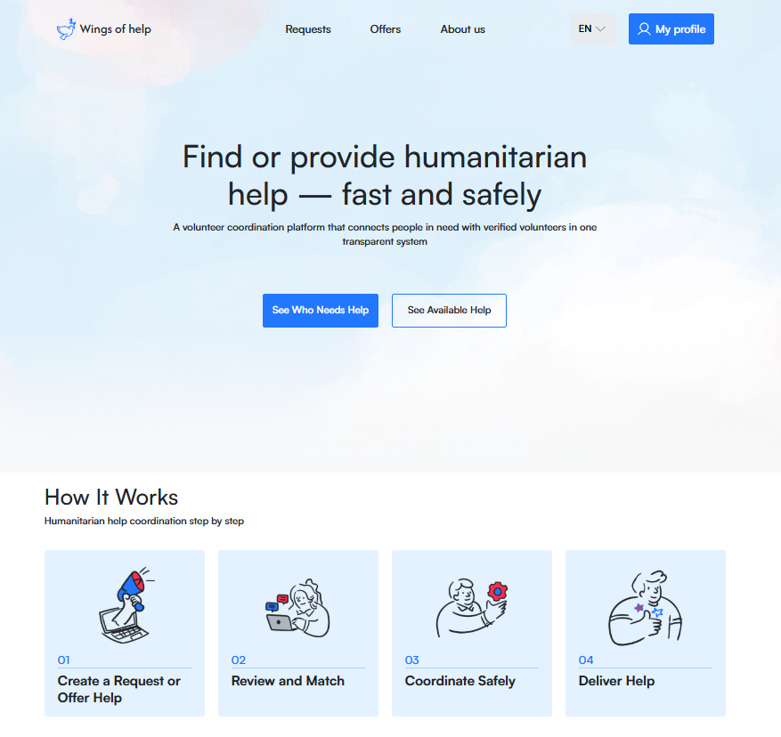

Wings of Help is a web platform designed to coordinate volunteer assistance.  
The platform connects people or organizations who need help with volunteers who are ready to provide it.

Users can create help requests, browse existing ones, take them into work, and track their status.

The project was created as an MVP with the goal of providing a simple and scalable solution for coordinating humanitarian support.

## Live Demo

🌐 **Frontend:**  
[Live Demo]([https://wingsofhelps.world](https://volunteer-site-placeholder-production.up.railway.app/))

⚙️ **Backend API:**  
[Swagger API](https://alert-ambition-dev.up.railway.app/api/v1/swagger/)

🎨 **Design:**  
[Figma](https://www.figma.com/design/nNG4BMbvvDTKRPgQAXmTlH/Wings-of-Help)
## Technologies

Frontend

- React
- TypeScript
- SCSS
- React Router
- Fetch API

Backend

- Django REST Framework
- PostgreSQL
- JWT Authentication
- Cloudinary

DevOps

- Docker
- CI/CD
- Railway

## Features

- User authentication (JWT)
- Create and manage help requests
- Request status tracking (New / In Progress / Done)
- Filtering and sorting requests
- Role-based functionality
- Multilanguage support (i18next)
- Responsive design

## Installation

Clone the repository

```bash
git clone https://github.com/wings-of-help/volunteer-site-placeholder
```

Install dependencies

```bash
npm install
```

Run the project

```bash
npm run dev
```

## Our team

**Anton Blyznyuk** – Backend Developer  
https://www.linkedin.com/in/anton-blyzniuk-python-dev/

**Maxim Prysyazhnikov** – DevOps Engineer  
https://www.linkedin.com/in/maxim-prysyazhnikov-b46196163/

**Sofia Kolomoiets** – UI/UX Designer  
https://www.linkedin.com/in/sophia-kolomoiets/

**Yulia Petrovska** – Frontend Developer  
https://www.linkedin.com/in/julya-petrovska-fd/

**Roman Rusin** – Frontend Developer  
https://www.linkedin.com/in/roman-rusin-866aa4322

**Kateryna Pyzhevska** – Digital Marketing  
https://www.linkedin.com/in/kateryna-pyzhevska-76aa65396

**Oksana Olar** – Data Analyst  
https://www.linkedin.com/in/oksana-olar/

**Yevheniia Zhakun** – QA Engineer  
https://www.linkedin.com/in/yevheniia-zhakun-497783391

## Preview


